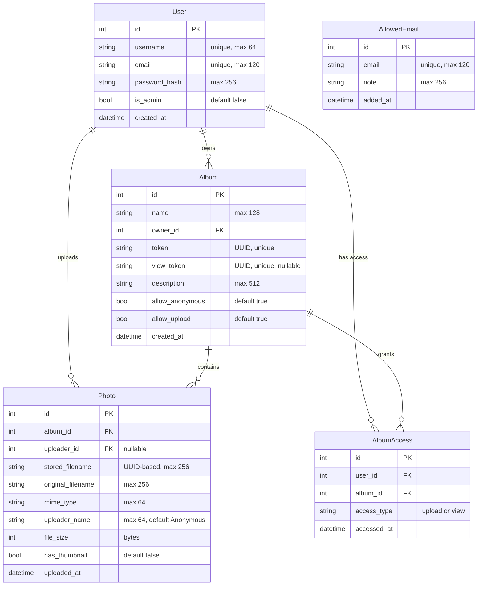

# PixelVault Database Schema

```mermaid
erDiagram
    User {
        int id PK
        string username "unique, max 64"
        string email "unique, max 120"
        string password_hash "max 256"
        bool is_admin "default false"
        datetime created_at
    }

    AllowedEmail {
        int id PK
        string email "unique, max 120"
        string note "max 256"
        datetime added_at
    }

    Album {
        int id PK
        string name "max 128"
        int owner_id FK
        string token "UUID, unique"
        string view_token "UUID, unique, nullable"
        string description "max 512"
        bool allow_anonymous "default true"
        bool allow_upload "default true"
        datetime created_at
    }

    AlbumAccess {
        int id PK
        int user_id FK
        int album_id FK
        string access_type "upload or view"
        datetime accessed_at
    }

    Photo {
        int id PK
        int album_id FK
        int uploader_id FK "nullable"
        string stored_filename "UUID-based, max 256"
        string original_filename "max 256"
        string mime_type "max 64"
        string uploader_name "max 64, default Anonymous"
        int file_size "bytes"
        bool has_thumbnail "default false"
        datetime uploaded_at
    }

    User ||--o{ Album : "owns"
    User ||--o{ AlbumAccess : "has access"
    User ||--o{ Photo : "uploads"
    Album ||--o{ Photo : "contains"
    Album ||--o{ AlbumAccess : "grants"
```
