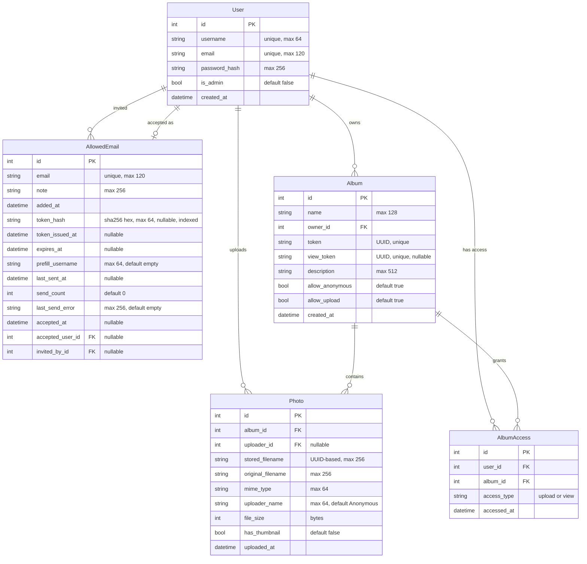

# PixelVault Database Schema

---

## AllowedEmail — the invite lifecycle

`AllowedEmail` is not a passive whitelist. One row is both the assertion that an
address may register *and* the credential that carries that permission to a person,
so it has a lifecycle. See [invite_registration_design.md](invite_registration_design.md)
§4 for why this is one table and not two.

**The token is never stored.** `token_hash` holds the SHA-256 of a
`secrets.token_urlsafe(32)` value; the plaintext exists only in the sent email and,
for the copy-link fallback, in one flash message. A leaked backup or a screenshot of
the admin page therefore cannot be used to create an account — and, as the accepted
cost, a link can never be re-shown, so resending mints a new token and kills the old
one. Lookup is an indexed equality match on the hash.

`expires_at` is denormalised from `token_issued_at` + `INVITE_TTL_HOURS` so the admin
table can display and sort honest expiry without re-deriving it against a config value
that may have changed since the token was minted.

### States

`AllowedEmail.state` is a **derived property**, never a column: the expiry test reads
the wall clock, so a stored value would be wrong from the moment a TTL lapsed with
nobody looking. It is evaluated in this order, and the order is the specification —
several rows satisfy more than one test at once.

| # | State | Row looks like | What an admin does about it |
|---|---|---|---|
| 1 | `ACCEPTED` | `accepted_at` set (`token_hash` nulled by consumption) | Nothing. Terminal — it outranks a TTL that lapsed afterwards. |
| 2 | `LEGACY` | no `token_hash`, never accepted | **Send invite.** Pre-migration rows land here. |
| 3 | `EXPIRED` | `now >= expires_at` | **Resend** — which rotates the token. |
| 4 | `SEND_FAILED` | `last_send_error` non-empty, token still live | Resend, or hand over the copy-link. The credential is fine; only delivery failed, which is why it ranks below `EXPIRED`. |
| 5 | `ISSUED` | token live, `last_sent_at` is NULL | Nothing sent yet — the copy-link path, or mail disabled. |
| 6 | `SENT` | token live, delivered, unclicked | Wait, then resend past the cooldown. |

`is_pending` is true for exactly `ISSUED`, `SENT`, and `SEND_FAILED` — the states where
a working link is outstanding.

`LEGACY` is load-bearing, not cosmetic. Every `allowed_email` row created before this
feature has no token, and once registration is link-only those addresses can no longer
be used at all. The state is what lets the admin panel list them as *"No invite sent"*
with a **Send invite** button, rather than having a migration email a year-old address
on deploy day.

### Migration

All ten columns are added by `_run_migrations()` as individual
`ALTER TABLE allowed_email ADD COLUMN` statements, plus
`CREATE INDEX IF NOT EXISTS ix_allowed_email_token_hash`. The three non-nullable columns
carry a literal SQL `DEFAULT` (`''`, `0`, `''`) because SQLite rejects a non-constant
default on `ADD COLUMN` and existing rows must be writable; the nullable ones take no
default, which is exactly what makes an untouched row read as `LEGACY`.
