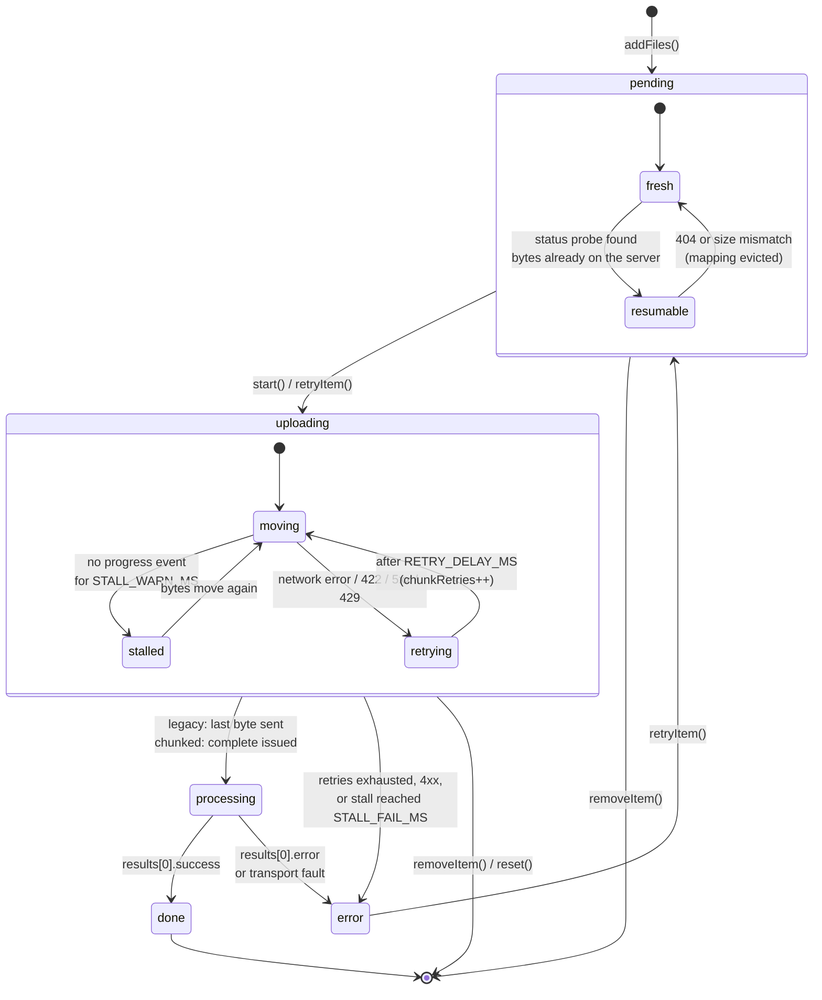
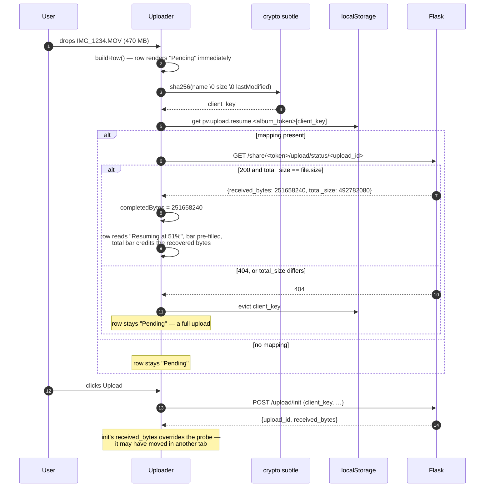
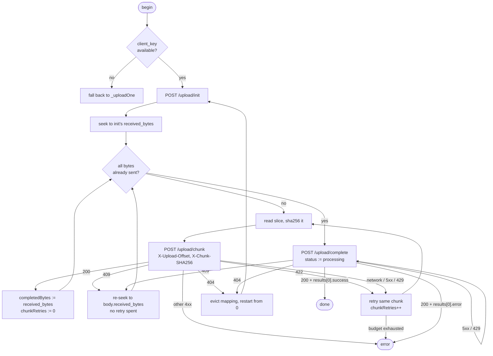

# Upload Client

Reference for `static/js/uploader.js` — the browser half of the chunked resumable upload work in
[#29](https://github.com/gfvandehei/PixelVault/issues/29). The wire contract it speaks is
[`upload_protocol.md`](upload_protocol.md); this document covers what the client does around those
requests: how a row moves through its states, how a resume is discovered, and how a cancel is made
to actually stop.

`Uploader` is instantiated by `templates/album_upload.html` and `templates/album_view.html`. Both
pass only the legacy upload URL; the chunked routes are derived from it, so adding chunking required
no template change.

---

## 1. Two transports, one interface

| File size | Transport | Requests |
|---|---|---|
| `<= CHUNK_THRESHOLD` (8 MiB) | `_uploadOne` — legacy, byte-for-byte unchanged | one multipart `POST /share/<token>/upload` |
| `> CHUNK_THRESHOLD` | `_uploadChunked` | `init` + N x `chunk` + `complete` |

`_upload(item)` picks between them. Both return a Promise that **resolves and never rejects**, so
`start()` and `retryItem()` cannot tell them apart and the concurrency pool is shared.

The gate is size **and** capability: chunking needs a SHA-256 per chunk, `crypto.subtle` only exists
in a secure context, and a `client_key` cannot be derived without it. On plain HTTP the client falls
back to the legacy path for every file. That may hit an edge body limit on a large video — but that
is exactly today's behaviour, so it is a missing improvement rather than a regression.

---

## 2. Per-item lifecycle

`item.status` takes five values. Two further conditions — *resumable* and *stalled* — are flags
layered onto `pending` and `uploading` rather than statuses of their own, because the queue in
`start()` selects on `status` and a stalled row must stay in flight while a resumable one must stay
queueable.



Two things this diagram is making explicit:

**`processing` moved on the chunked path.** The legacy transport enters it from
`xhr.upload.onload` — the last byte of the multipart body has left the browser and the server is now
converting HEIC and cutting thumbnails. Chunked uploads have no such moment: the last chunk's bytes
only reach a `.part` file. `processing` therefore begins when `complete` is issued, which is the
request that actually does validation, conversion and thumbnailing. It is the more honest signal.

**`retrying` sits inside `uploading`, not in `pending`.** A chunked retry keeps `status ===
'uploading'` so the watchdog keeps watching it, and `item.lastProgressAt` is refreshed before the
backoff timer so a deliberate 5-second pause after a `429` is not misread as a stall.

---

## 3. Resume on file add

The probe runs from `addFiles`, not from `start()`. The user should be told a file is resumable
while deciding whether to upload it — telling them afterwards is not information, it is trivia.



The probe result is **advisory**. `init` is idempotent on `client_key` and returns the authoritative
`received_bytes`, so the run always seeks to what `init` says, never to what the probe said. The
probe exists to populate the UI, and it is discarded silently if the row stops being pending before
it lands.

A network error during the probe does **not** evict the mapping — only a `404` or a `total_size`
mismatch does. A transient outage should not cost the user a resume.

### The resume store

```jsonc
// localStorage key: "pv.upload.resume.<album_token>"
{ "<client_key>": { "id": "<upload_id>", "at": 1755500000000 } }
```

Namespaced by album token, because the same file dropped into two albums yields the same
`client_key` and the sessions are not interchangeable — the server would reject the other album's
`upload_id` as not the caller's.

`ResumeStore` degrades rather than throws. It probes with a real `setItem`/`removeItem` round trip
at construction (private-browsing modes throw on first *use*, not on property access), prunes
entries past `RESUME_TTL_MS` on every construction, and on a quota failure deletes its own key and
disables itself permanently. Our entries are a few dozen bytes; if the quota is gone, the pressure
is someone else's, and losing resumability beats breaking the upload.

Mappings are evicted on completion — success *or* per-file validation failure, since either way the
server has dropped the session. `reset()` deliberately does not evict: the user cleared the list,
not the upload, and re-adding the file should still resume.

---

## 4. The chunk loop

Written as mutually tail-calling steps rather than a promise chain, because `409` and `404` both
jump *backwards* and a chain cannot express that without unwinding.



| Response | Treatment | Why |
|---|---|---|
| `409` | Re-seek to `body.received_bytes` and resume sending chunks. **Costs no retry budget.** `complete` can answer this too — the server refuses to assemble unless `received_bytes == total_size`, so a chunk we counted as accepted but that did not survive surfaces here. | Normal control flow — it is how a resuming client discovers the true offset, and two tabs racing one session produce it legitimately. Capped at `MAX_OFFSET_RESYNCS` consecutive occurrences so a server stuck at one offset is a failure, not a livelock. |
| `422` | Retry the *same* chunk at the *same* offset. Costs one retry. | The bytes arrived corrupt. Nothing was written, so the offset is still valid. |
| `404` | Evict the mapping, `init` a fresh session, restart from zero. Once. | The session expired or was swept; the `.part` file went with it, so there is nothing to seek to. |
| `429` | Retry after `RATE_LIMIT_DELAY_MS`, then surface. | Every non-`200` is charged server-side against a 600/hour failure budget; successes are free. A `429` therefore means a run of genuine refusals, not upload volume. |
| `401` | Surface "Session expired — reload the page". | Reachable on the chunked endpoints: an anonymous or expired-session request returns JSON `401` rather than redirecting to the HTML login page, which XHR would otherwise follow transparently and report as a bare "Upload failed". |
| `5xx` / network | Retry the current step. | May be transient. |
| other `4xx` | Fail permanently. | Will fail identically on retry. |

`MAX_AUTO_RETRIES` is applied **per chunk**, not per file — the counter resets on every accepted
chunk. A 59-chunk upload that hits one blip per chunk should still finish; a file-wide budget of 1
would abandon it on the first hiccup of a twenty-minute transfer.

---

## 5. Progress accounting

`_onProgress(item, loaded, total)` is unchanged and is fed `completedBytes + e.loaded` for the chunk
in flight, so `loaded` stays absolute across the whole file. Every consumer below it works as before:
the 3-second rolling-window rate estimate, the ETA derived from it, and the byte-weighted total bar.

The window is cleared (`item.samples = []`) at the three points where `loaded` moves *backwards* —
a `409` re-seek, a chunk retry, and a session restart. Keeping the old samples across a backwards
jump would compute a negative rate and a nonsense ETA.

A resumed row sets `item.loaded = received_bytes` before the run starts, so the aggregate bar credits
bytes that are already on the server rather than pretending they must be sent again.

---

## 6. Cancellation

`item.xhr` is repointed to the request currently in flight by `_request`, so `removeItem`,
`retryItem` and the watchdog's stall abort all keep working per chunk with no changes to their call
sites. But aborting the socket only kills one of 59 requests — the *loop* has to stop too, and two
mechanisms are needed for that:

| Mechanism | Set by | Stops |
|---|---|---|
| `item.cancelled` | `removeItem`, `reset` | A loop whose row is gone |
| `item.runId` | `_upload`, on every run | A loop *superseded* by a newer run |

The flag alone is not enough. `xhr.abort()` settles its promise in a **microtask**, so a synchronous
`retryItem()` — abort, clear the flag, start a fresh run — has already cleared `cancelled` by the
time the old loop's continuation runs, and the old loop would happily fire the next chunk against a
session the new loop is also writing to. Each run captures the `runId` it was started with and
compares it on every step; a stale run sees a mismatch and stands down.

Every request outcome is checked for `aborted` **before** the stopped check, because the watchdog's
stall abort is the one abort that must still be reported as an error rather than swallowed:

```
if (res.aborted) return afterAbort();   // stallAbort -> error row; otherwise silent
if (stopped())   return bail();         // row removed or superseded — touch nothing
```

---

## 7. Tunable constants

Shared with the legacy path:

| Constant | Value | Rationale |
|---|---|---|
| `CONCURRENCY` | 3 | Enough to keep a link saturated when files are small; low enough that three 8 MiB chunk buffers (24 MiB) is the worst-case memory footprint |
| `RATE_WINDOW_MS` | 3000 | Long enough to smooth TCP burstiness, short enough that the readout tracks the current connection instead of lagging it |
| `RATE_MIN_ELAPSED_MS` | 500 | Rates computed off the first few hundred milliseconds are dominated by connection setup |
| `RATE_MIN_BYTES` | 1 MiB | Below this a file finishes before an ETA would be read |
| `MAX_AUTO_RETRIES` | 1 | Per chunk on the chunked path. One retry clears a transient blip; more just delays telling the user something is wrong |
| `WATCHDOG_MS` | 1000 | Resolution of the stall and processing counters |
| `STALL_WARN_MS` | 20000 | Well past any legitimate gap between progress events, including a slow server writing a chunk to disk |
| `STALL_FAIL_MS` | 90000 | Abort so the row becomes retryable. `xhr.timeout` is deliberately never set — it caps *total* duration, which would kill a legitimately slow 470 MB video |
| `PROCESS_WARN_MS` | 60000 | HEIC conversion and video thumbnailing are genuinely slow; past a minute the message changes rather than the state |

Chunked path only:

| Constant | Value | Rationale |
|---|---|---|
| `CHUNK_SIZE` | 8 MiB | Mirrors `UPLOAD_CHUNK_SIZE` in the protocol — ~13 s on a 5 Mbit uplink, inside Gunicorn's worker timeout and far under Cloudflare's 100 MB edge cap. **The server's `init` response overrides this**, so the value can be changed server-side without a client deploy |
| `CHUNK_THRESHOLD` | 8 MiB | At or under one chunk, the chunked protocol costs three requests to do what one already does. The legacy path is proven; it keeps every file it can |
| `RETRY_DELAY_MS` | 800 | Matches the legacy path's backoff |
| `RATE_LIMIT_DELAY_MS` | 5000 | A `429` means real pressure, not a blip — retrying in 800 ms would just earn another |
| `MAX_OFFSET_RESYNCS` | 5 | Consecutive `409`s. Legitimate re-seeks resolve in one; five in a row without the offset moving is a livelock |
| `MAX_SESSION_RESTARTS` | 1 | A `404` restart re-sends everything. Doing it twice means the sessions are expiring faster than the file uploads, which is a failure to report, not to keep retrying |
| `RESUME_TTL_MS` | 24 h | Mirrors `UPLOAD_SESSION_TTL_HOURS`; a mapping that outlives its server session is only ever a wasted probe |

---

## 8. Known limits

- **A `File` handle cannot survive a page reload.** The user must re-select the file; only the
  transfer resumes, not the selection. Platform constraint, not a design choice.
- **No cross-tab coordination.** Two tabs uploading the same file into the same album share a
  session and will trade `409`s until one of them wins. It converges — both are seeking to the same
  authoritative offset — but it wastes bandwidth.
- **Chunks are sequential within a file.** The protocol's offset check is a strict equality against
  `received_bytes`, so parallel chunks within one file are not expressible. Concurrency comes from
  uploading three *files* at once.
- **A file replaced on disk mid-upload fails the row.** `FileReader` errors on the stale handle;
  retrying reads the same dead handle, so it is reported rather than retried.
