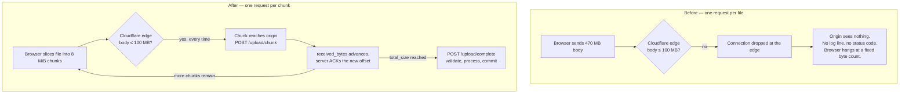
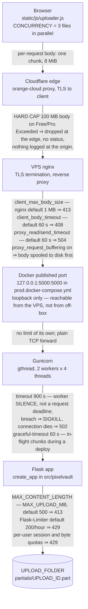
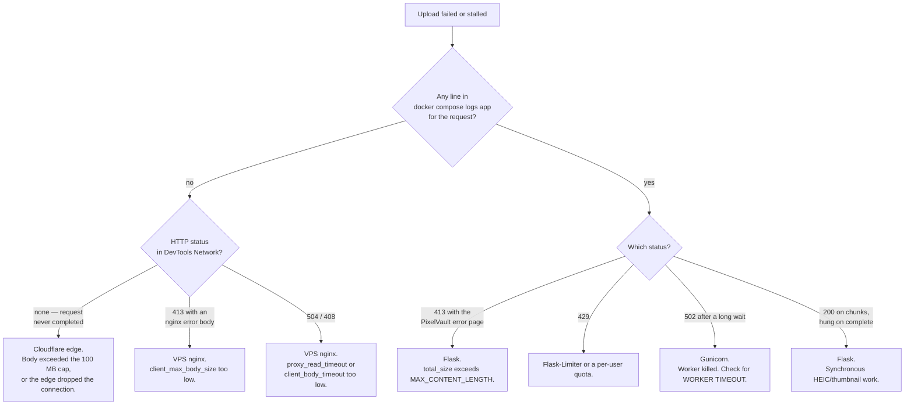
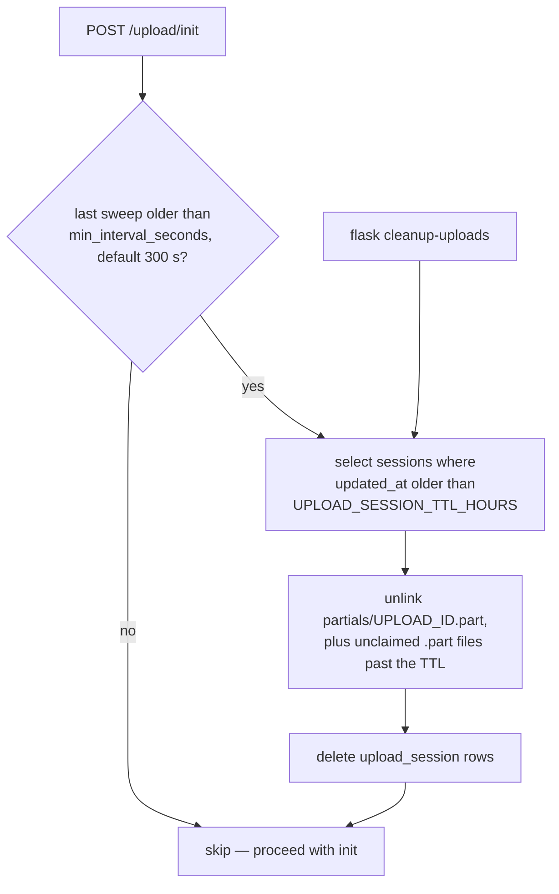

# Upload Operations Guide

Operational and architectural reference for the upload subsystem: where uploads can fail, which
component to blame for a given symptom, what to set, and what to back up.

For the wire contract between `static/js/uploader.js` and the endpoints in
`src/pixelvault/routes/share.py`, see [`upload_protocol.md`](upload_protocol.md). That document is
normative for request and response shapes; this one is normative for nothing and useful for
everything else.

Implements the operational half of [#29](https://github.com/gfvandehei/PixelVault/issues/29).

---

## 1. The failure this solves

Large uploads to `photos.gvandehei.com` stalled permanently and left **no trace in the application
logs**. That combination — a client that hangs and a server that never saw a request — is the
signature of a rejection upstream of the origin.

The domain is proxied through Cloudflare:

```
$ curl -sSI https://photos.gvandehei.com
server: cloudflare
cf-cache-status: DYNAMIC
cf-ray: a2d16ed28f438ff9-BOS
```

`server: cloudflare` and the presence of `cf-ray` confirm the request is terminated at Cloudflare's
edge, not at the VPS. **Cloudflare's free plan caps request bodies at 100 MB.** A 470 MB upload is
rejected there. The origin never receives the request, so:

- nothing appears in gunicorn, nginx, or Flask logs;
- the browser observes bytes ceasing to move with no HTTP status;
- the `413 → "File too large"` mapping in `static/js/uploader.js` never fires, because no 413 is
  ever delivered.

It presents as a silent stall rather than an error. This is not a bandwidth problem — measured
throughput between the uploading device, the VPS, and the origin ranges from 40–400 Mbit/s.

> **On the exact symptom:** Cloudflare can also answer an oversized request with its own 413 error
> page, so a 413 whose body is Cloudflare-branded means the edge, not the origin. The silent stall
> is the common shape for a *large streaming* upload specifically: the edge stops reading and closes
> the connection while the browser is still sending, so the browser reports a transport failure and
> never surfaces a status. Both symptoms point at the same cap — treat a Cloudflare-branded 413 and
> a mid-body stall as the same diagnosis.

### Paying does not fix it

| Cloudflare plan | Max request body |
|---|---|
| Free | **100 MB** |
| Pro | 100 MB |
| Business | 200 MB |
| Enterprise | 500 MB (default, raisable on request) |

`MAX_UPLOAD_MB` already defaults to `500` (`src/pixelvault/config.py`), so even Enterprise's default
only just reaches what the application already advertises, and Pro — the first paid tier — buys
nothing at all. The alternatives were both worse:

| Option | Why it was rejected |
|---|---|
| Upgrade the Cloudflare plan | Caps out at the value the app already permits; costs money for no headroom |
| Grey-cloud the DNS record | Exposes the origin IP and drops edge TLS termination |
| Chunked uploads | Scales past the cap at any plan tier and keeps the topology intact |

Uploads are therefore sliced into `UPLOAD_CHUNK_SIZE` (8 MiB) requests, each far below every tier's
cap. Resumability falls out of the same design for free: a dropped connection costs one chunk
rather than the whole file.



A 470 MB file becomes roughly 59 chunks plus one `init` and one `complete`.

---

## 2. The request path

Every upload byte crosses five boundaries, and each one enforces a different limit with a different
failure mode. **This is the chart to consult first when an upload misbehaves.**



### Who enforces what

| Hop | Limit | Configured where | Symptom when breached |
|---|---|---|---|
| Cloudflare | 100 MB request body (Free/Pro) | Cloudflare plan; not configurable below Enterprise | Silent stall, no status, no origin log |
| VPS nginx | `client_max_body_size`, `client_body_timeout`, `proxy_read_timeout`, `proxy_send_timeout` | The VPS nginx config — see [#28](https://github.com/gfvandehei/PixelVault/issues/28) | 413, 408, or 504 with an nginx error page |
| Docker port publish | no size or time limit; bound to `127.0.0.1` so only the VPS itself can connect | `docker/prod.docker-compose.yml` | Connection refused from anywhere but the VPS — deliberate ([#42](https://github.com/gfvandehei/PixelVault/issues/42)) |
| Gunicorn | `--timeout`, `--graceful-timeout`, concurrency | `docker/Dockerfile.prod` | 502, or a connection reset with `WORKER TIMEOUT` in the container log |
| Flask | `MAX_CONTENT_LENGTH`, rate limits, per-user quotas | `src/pixelvault/config.py`, `src/pixelvault/extensions.py` | 413 / 429 rendered by `templates/error.html` |

The single most useful discriminator: **a failure that leaves no line in `docker compose logs app`
did not reach the application.** Look upstream — Cloudflare first, then nginx.

### Note on the nginx hop

`conf/nginx.conf` in this repo is **not** the config serving production. It is mounted into the
`nginx` service in `docker/prod.docker-compose.yml`, which is gated behind `profiles: [nginx]` and
does not start by default; the real deployment terminates TLS on a separate VPS reverse proxy, which
reaches the app container on `127.0.0.1:5000`. A standalone server block for the real topology is
tracked in [#28](https://github.com/gfvandehei/PixelVault/issues/28) — that is also where the
`CF-Connecting-IP` handling recommended in
[configuration.md §6.2](configuration.md#62-recommended-recover-the-real-client-ip-from-cloudflare)
belongs. Until it lands, verify the live values directly on the VPS rather than reading them out of
this repo:

```bash
nginx -T | grep -E 'client_max_body_size|client_body_timeout|proxy_(read|send)_timeout|proxy_request_buffering'
```

### Timeout budget

Timeouts must increase as you move inward, or an outer hop will give up on a request the inner hop
is still working on and the client will see a 504 for work that eventually succeeded.

| Layer | Setting | Value |
|---|---|---|
| Browser stall watchdog | `STALL_WARN_MS` / `STALL_FAIL_MS` in `static/js/uploader.js` | 20 s warn, 90 s abort |
| VPS nginx | `proxy_read_timeout` | must exceed the slowest single chunk; nginx's 60 s default is too low |
| Gunicorn | `--timeout` | 900 s |

The browser watchdog is the tightest by design: it measures *no bytes moving*, not elapsed time, so
a healthy slow upload never trips it while a genuinely dead socket surfaces in 90 s instead of
hanging forever.

---

## 3. Gunicorn configuration

`docker/Dockerfile.prod` runs:

```
gunicorn --bind 0.0.0.0:5000 --worker-class gthread --workers 2 --threads 4 \
         --timeout 900 --graceful-timeout 60 app:create_app()
```

Two things were wrong with the previous `--workers 2 --timeout 120` sync configuration.

**Sync workers plus `--timeout` is a trap.** Gunicorn's `--timeout` is a worker-*silence* timeout,
not a request deadline. A sync worker only heartbeats between requests, so any single request
exceeding the timeout looks identical to a hung worker and gets SIGKILLed. The connection dies with
no HTTP status — the same shape as the Cloudflare failure above, so from the browser the two are
indistinguishable. `gthread` heartbeats from a separate thread, so a long request is no longer
mistaken for a dead worker.

**2 sync workers is 2 concurrent requests.** `uploader.js` uses `CONCURRENCY = 3`, so the third file
queued and everything else — thumbnails from `/media`, `/api` gallery JSON — blocked behind the
uploads. `2 x 4` threads gives 8 concurrent requests.

**Why the long timeout is still needed after chunking.** No single 8 MiB chunk comes close to 120 s.
But the `complete` step runs `validate_file` and `save_file` synchronously inside one request:
HEIC-to-JPEG decode, `ImageOps.exif_transpose`, and 400x400 `Image.LANCZOS` thumbnail generation
(`src/pixelvault/utils.py`). A very large image can exceed 120 s in that single request even though
its transfer was perfectly chunked. Chunking fixed the transfer; it did not make image processing
asynchronous.

`--graceful-timeout 60` bounds how long a deploy waits for in-flight chunks before killing them.
Chunks are individually short, so 60 s is generous; the point is that a redeploy during a large
upload costs the client one chunk retry, not a stuck restart.

**One thing to watch after this change.** Raising concurrency from 2 to 8 also raises concurrent
writers against SQLite, and every accepted chunk issues an `UPDATE upload_session`. SQLite
serialises writers, so a heavy multi-user upload burst can surface as `database is locked`. If that
appears in the app log, the levers are fewer threads, a larger `UPLOAD_CHUNK_SIZE` (fewer writes per
byte transferred), or WAL mode on the database — not a longer gunicorn timeout.

---

## 4. Configuration

New environment variables introduced by chunked uploads, all defined in `src/pixelvault/config.py`.

| Variable | Default | Description |
|---|---|---|
| `UPLOAD_CHUNK_SIZE` | `8388608` (8 MiB) | Chunk size in bytes handed to the client at `init`. Must stay well under the smallest body cap on the path |
| `UPLOAD_SESSION_TTL_HOURS` | `24` | How long a partial upload remains resumable before the sweep reclaims its row and `.part` file |
| `MAX_CONCURRENT_UPLOADS_PER_USER` | `10` | Open upload sessions one user may hold at once. Rejected at `init` |
| `MAX_INFLIGHT_UPLOAD_MB_PER_USER` | `2048` | Total declared bytes across a user's open sessions, in MB. Read into `MAX_INFLIGHT_UPLOAD_BYTES_PER_USER`. **Must be at least `MAX_UPLOAD_MB`** — see below |
| `TRUSTED_PROXY_COUNT` | `1` | Proxies that append to `X-Forwarded-For` before the request reaches Flask; consumed by `ProxyFix`. See [#30](https://github.com/gfvandehei/PixelVault/issues/30) |

Note the asymmetry in the fourth row: the **environment variable is in megabytes**
(`MAX_INFLIGHT_UPLOAD_MB_PER_USER`) while the config constant it populates is in bytes
(`MAX_INFLIGHT_UPLOAD_BYTES_PER_USER`), mirroring the existing `MAX_UPLOAD_MB` →
`MAX_CONTENT_LENGTH` relationship.

The partials directory name is `partials`, fixed in `UPLOAD_PARTIALS_SUBDIR` and deliberately not
environment-configurable — nothing should be able to point it at the served media root.

### The caps have to agree with each other

`MAX_INFLIGHT_UPLOAD_MB_PER_USER` must be **at least `MAX_UPLOAD_MB`**, and ideally
**three times it**:

```
MAX_INFLIGHT_UPLOAD_MB_PER_USER  >=  3 x MAX_UPLOAD_MB
```

Below `1x` the feature is simply broken for large files: `init` accepts the declared
`total_size` against `MAX_CONTENT_LENGTH`, then the per-user quota refuses the same
number, so **no file above the in-flight cap can ever be uploaded** — and the user sees a
quota message with nothing in flight. Raising `MAX_UPLOAD_MB` without raising this is the
single easiest misconfiguration to make, because `MAX_UPLOAD_MB` is the knob whose name
suggests it governs how large a file may be.

Below `3x` only batches suffer: the browser uploads three files in parallel
(`CONCURRENCY` in `static/js/uploader.js`) and each open session reserves its **full
declared size** from the first byte, so part of a batch of large files is refused at
`init` until its siblings finish.

`validate_upload_limits()` in `config.py` checks this at boot and logs it — at `ERROR`
for the first case, `WARNING` for the second. It never aborts startup: a contradictory
pairing degrades the upload feature, and turning that into a crash-looping container on
an existing deployment would be worse. Grep the boot logs for `Upload limit`:

```bash
docker compose -f ./docker/prod.docker-compose.yml logs app | grep 'Upload limit'
```

It also flags `UPLOAD_CHUNK_SIZE > MAX_UPLOAD_MB` (every chunk would 413) and
`MAX_CONCURRENT_UPLOADS_PER_USER < 1` (no session can be opened at all).

### `TRUSTED_PROXY_COUNT` is a security setting, not a tuning knob

Setting it **higher** than the true hop count lets a caller's own `X-Forwarded-For` header survive
into the region `ProxyFix` trusts, so any client can name any IP and pick its own rate-limit bucket.
That converts a shared bucket into a bypassable one, which is worse than the bug being fixed. When
unsure, set it too low. The correct value must be confirmed against the live nginx config; see
[#30](https://github.com/gfvandehei/PixelVault/issues/30) for the full reasoning.

A caller that reaches the app *without* going through the proxy gets the same result for free, no
matter what the count is set to: with no proxy in front, its own header is the first one and lands
in the trusted position. That is why the published port is bound to `127.0.0.1` in
`docker/prod.docker-compose.yml` and why `TRUSTED_PROXY_COUNT` is set in the same file — the hop
count and the reachability of the origin are one decision described in two lines
([#42](https://github.com/gfvandehei/PixelVault/issues/42),
[configuration.md §6.1](configuration.md#61-the-hop-count-is-only-true-if-the-hops-cannot-be-skipped)).

---

## 5. Troubleshooting

Start from the symptom, identify the hop, then confirm before changing anything.



| Symptom | Likely hop | How to confirm |
|---|---|---|
| Upload stalls at a fixed byte count, no status code, nothing in app logs | **Cloudflare edge** | `curl -sSI https://your-domain` shows `server: cloudflare` and a `cf-ray`. Compare the stall point against 100 MB. Retry the same file against the origin directly, bypassing the edge — if it succeeds, the edge is the cause. The published port is bound to loopback ([#42](https://github.com/gfvandehei/PixelVault/issues/42)), so run that test **from the VPS** against `http://127.0.0.1:5000`, or tunnel to it with `ssh -L 5000:127.0.0.1:5000 vps`. Never widen the binding to run a test |
| **413 immediately**, before any progress | **VPS nginx** if the body is an nginx error page; **Flask** if it is `templates/error.html` | View the response body. For nginx: `nginx -T \| grep client_max_body_size` and `grep "client intended to send too large body" /var/log/nginx/error.log`. For Flask: compare the file size against `MAX_UPLOAD_MB` |
| **504 mid-upload**, browser hangs at a fixed percentage | **VPS nginx** | `grep "upstream timed out" /var/log/nginx/error.log`. Check `proxy_read_timeout` and `proxy_send_timeout` — nginx defaults to 60 s, which one slow chunk can exceed |
| Upload reaches **100% then hangs in "Processing"** | **Flask `complete`**, or nginx request buffering | Watch `docker compose logs -f app` for the `complete` request. If it is running, the wait is real synchronous HEIC/thumbnail work — raise `--timeout` or accept the wait. If no request has arrived, nginx is still replaying a buffered body: check `proxy_request_buffering`. A `WORKER TIMEOUT` line means gunicorn killed the worker mid-processing |
| **429 at the start of an upload**, message naming an "in-flight limit" | **Flask, per-user quota** — not the rate limiter | The message states the arithmetic: the cap, what the file needs, what is free, and how many sessions hold the rest. Usual cause is stale reservations — every open session holds its full declared size for `UPLOAD_SESSION_TTL_HOURS` even if not a byte has moved. Removing a file from the uploader queue now cancels its session and releases the reservation at once; `flask cleanup-uploads` clears what expired. If the message says nothing is free while nothing is uploading, check the caps agree (§4) |
| **429 while browsing thumbnails** | **Flask-Limiter** | Every non-decorated route inherits the default `200 per hour` (`src/pixelvault/extensions.py`), and one album view spends one request per photo against `/media`. If `TRUSTED_PROXY_COUNT` is wrong, `get_remote_address` returns the proxy address instead of the client's and **all visitors share one bucket** — check it against the real hop count first ([#30](https://github.com/gfvandehei/PixelVault/issues/30)). `/media` responses are `private, max-age=31536000, immutable`, so repeat views are cached and free; the exposure is first views and new visitors. Confirm by watching whether a second concurrent visitor triggers it |

Two further notes on the 429 row. Limits are stored in `memory://` and the store is per **process**,
so with 2 workers there are two independent buckets assigned by whichever worker accepts the
connection, and both reset on every restart — a limit that appears to be 200/hour behaves as
anywhere between 200 and 400 depending on scheduling. And a 429 on an `` request renders as a
broken thumbnail, not an error page, which is why this symptom rarely looks like rate limiting.

---

## 6. Deployment and upgrade notes

### Dependencies and image builds

`docker/Dockerfile.prod` installs dependencies with `uv sync --locked`, from `uv.lock`. It used to
run `pip install .`, which re-resolved the floors in `pyproject.toml` on every build — so two builds
of the same commit could ship different dependency trees, and the image that passed testing was not
necessarily the image that got deployed ([#45](https://github.com/gfvandehei/PixelVault/issues/45)).

Three consequences for anyone changing a dependency:

1. **`uv.lock` is the source of truth for the production image.** After editing `pyproject.toml`,
   run `uv lock` and commit the result. `--locked` checks that the two agree and **fails the
   build** if they do not — that failure is deliberate. The alternative, `--frozen`, would build an
   image quietly missing the new package and surface it as an `ImportError` at boot instead.
2. **`requirements.txt` is for local development only** and its floors must stay at or above the
   locked versions. `.github/workflows/dependency-audit.yml` enforces that and audits the locked
   set against the PyPI advisory database on every dependency change and once a week.
3. **uv itself is pinned** in the Dockerfile. An unpinned installer resolving pinned dependencies
   just moves the irreproducibility up a level. Bumping it is a one-line commit like any other.

Rebuild after a lock change with the usual command — nothing extra is needed:

```bash
docker compose -f ./docker/prod.docker-compose.yml --env-file .env.prod up -d --build
```

### Database

The `upload_session` table is created by `_run_migrations()` in `src/pixelvault/__init__.py` on
every boot, using the same `CREATE TABLE IF NOT EXISTS` pattern as `album_access`. **There is no
manual migration step.** Deploy the new image and the table appears; there is no Alembic in this
project and nothing to run by hand.

Rolling back to a previous image is safe: the extra table is simply never queried. Rolling back does
strand any `.part` files whose sessions were open at the time, since the older image has no sweep —
delete `UPLOAD_FOLDER/partials/` by hand in that case.

### Filesystem

A `partials/` subdirectory now appears inside `UPLOAD_FOLDER`:

```
UPLOAD_FOLDER/
├── <uuid>.jpg          committed originals
├── <uuid>_thumb.jpg    generated thumbnails
└── partials/
    └── <upload_id>.part    in-progress uploads, one per open session
```

| Requirement | Reason |
|---|---|
| Same filesystem as `UPLOAD_FOLDER` | `complete` finalises the assembled `.part` file into the media root. If `partials/` is a mount on a different device, that finalisation becomes a full second copy of the file — precisely the second 470 MB write the append-in-place design exists to avoid |
| **Exclude from backups** | Partials are transient, unvalidated, and can hold up to `MAX_INFLIGHT_UPLOAD_MB_PER_USER` per active user. Backing them up captures bytes that may never become a `Photo` row |
| **Exclude from any static file serving** | Contents are unvalidated — magic-byte checking happens authoritatively at `complete`. Media is served only through `/media/<filename>` from DB-sourced names, which cannot reference `partials/` |
| Count it in free-space planning | Worst case is `MAX_CONCURRENT_UPLOADS_PER_USER` sessions per user bounded by `MAX_INFLIGHT_UPLOAD_MB_PER_USER` — 2 GB per user at the defaults |

Since backups already need to cover `UPLOAD_FOLDER` and `instance/pixelvault.db`, the practical
change is one exclusion line:

```bash
rsync -a --exclude 'partials/' "$UPLOAD_FOLDER" /backup/pixelvault/uploads/
```

### Cleanup

Abandoned sessions leak `.part` files. There is no Celery or cron worker in this stack, so the sweep
runs opportunistically inside `init`, throttled so it costs nothing on a normal upload:



Two triggers, one code path — `maybe_sweep_expired_sessions` wraps `sweep_expired_sessions` with a
300 s throttle. The clock is per worker process, so a busy deployment sweeps somewhat more often
than the interval; the sweep is idempotent, so that is harmless. The CLI form runs the same sweep
unconditionally:

```bash
# inside the app container
flask --app app cleanup-uploads
```

Reach for it when disk pressure needs relieving immediately rather than at the next upload, after a
rollback, or when a user reports a resume that should have expired. It is safe to run at any time:
it only touches sessions already past their TTL, so an upload in progress is never affected.

Orphaned `.part` files — ones no session row claims, left by an album deleted out from under an
upload or a crash between the two steps of `discard_session` — are handled too: the sweep also
unlinks any `.part` file whose mtime is older than the TTL and which no live session claims.
Nothing needs deleting by hand under normal operation. The exception is a rollback to an image with
no sweep at all.

---

## 7. Tuning

### `UPLOAD_CHUNK_SIZE`

Default 8 MiB. The tradeoff is round trips against re-sent data.

| Direction | Gain | Cost |
|---|---|---|
| **Larger** (e.g. 32 MiB) | Fewer requests per file — a 470 MB file drops from ~59 chunks to ~15 — so less per-request overhead, fewer DB updates, fewer `init`/`complete`-adjacent round trips | A failed chunk re-sends more data. Each chunk takes longer, so it must clear every timeout on the path, including nginx's `proxy_read_timeout`. And it moves closer to the 100 MB edge cap — the thing this design exists to stay clear of |
| **Smaller** (e.g. 2 MiB) | More resilient on a flaky link: a drop costs less, and progress advances in finer increments | More requests per file, so more HTTP and TLS overhead, more SHA-256 boundaries, and more `UPDATE received_bytes` statements against SQLite |

8 MiB was chosen because it completes in roughly 13 s on a 5 Mbit uplink — comfortably inside every
timeout on the path — while staying an order of magnitude below the 100 MB cap, leaving room for
headers and any future tier change. Raising it much past ~32 MiB starts trading that margin away for
diminishing returns, and the margin under the edge cap is the entire point of the design.

Changing it affects only *new* sessions. The value is handed to the client at `init`, so a session
opened before the change keeps its original chunk size for its whole life and resumes correctly.

### `UPLOAD_SESSION_TTL_HOURS`

Default 24. The tradeoff is resume window against disk held by abandoned partials.

| Direction | Gain | Cost |
|---|---|---|
| **Longer** (e.g. 72) | A user who runs out of mobile data, closes the tab, and returns the next evening still resumes. This is the real-world case driving [#29](https://github.com/gfvandehei/PixelVault/issues/29) | Abandoned `.part` files occupy disk for longer. With per-user in-flight caps the total is bounded, but the steady-state floor rises |
| **Shorter** (e.g. 6) | Disk reclaimed sooner | Resume degrades to within-session recovery. An overnight gap starts the upload from zero |

24 hours covers "same day, later" without letting a genuinely abandoned upload sit for a week. Raise
it only if disk is comfortable and users routinely upload over intermittent mobile connections.

Note that the TTL is measured from `updated_at`, not `created_at` (`UploadSession.expires_at` in
`src/pixelvault/models.py`): an upload that is still making progress is never swept mid-transfer
under a slow client, however long it takes overall. Only a genuinely silent session expires.

---

## 8. Related

| Issue | Relationship |
|---|---|
| [#29](https://github.com/gfvandehei/PixelVault/issues/29) | Chunked resumable uploads — the work this document accompanies |
| [#30](https://github.com/gfvandehei/PixelVault/issues/30) | `ProxyFix` and per-user rate-limit keying — a prerequisite for #29's per-user quotas, and the source of `TRUSTED_PROXY_COUNT` and the 429-while-browsing symptom above |
| [#28](https://github.com/gfvandehei/PixelVault/issues/28) | VPS reverse-proxy nginx config. Owns the nginx hop in the diagram above; the timeouts and `client_max_body_size` referenced throughout are set there |
