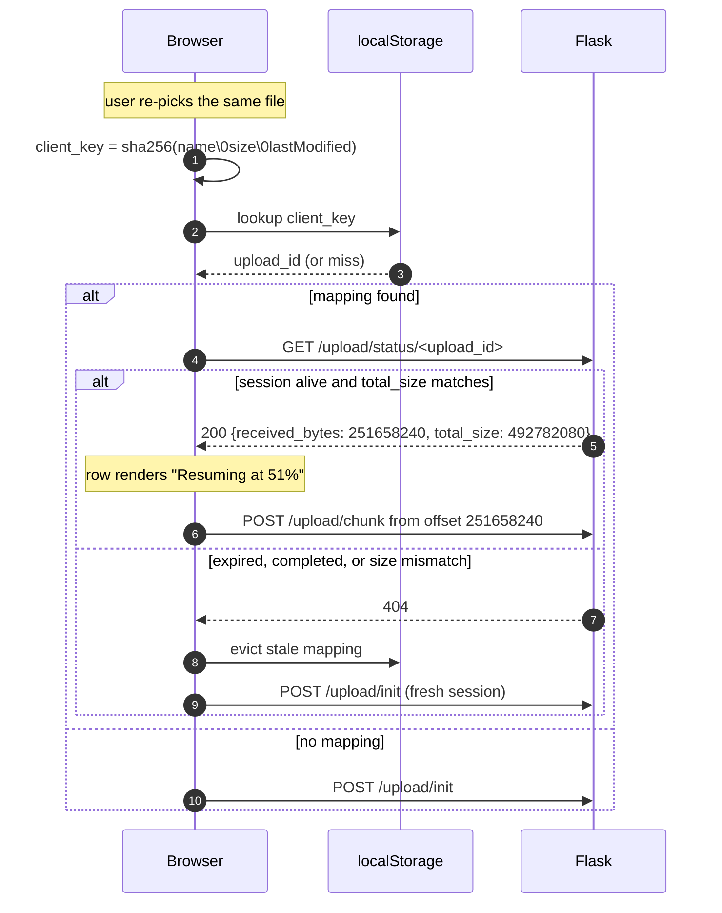
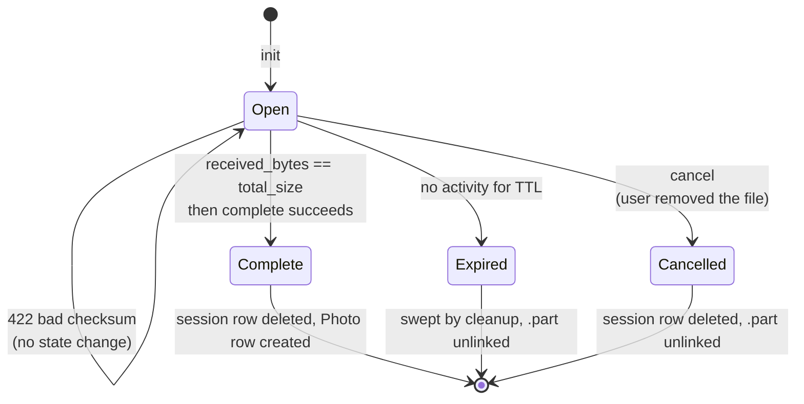
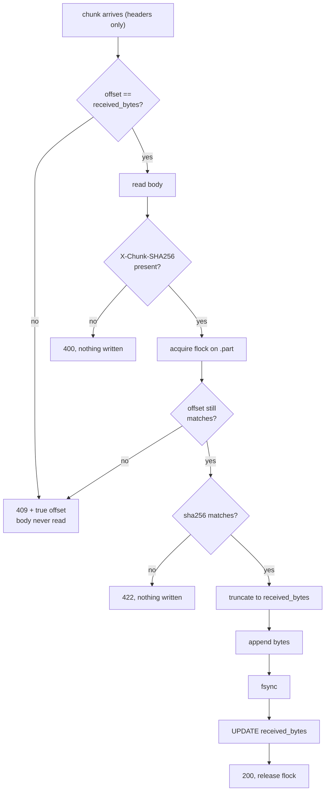

# Chunked Resumable Upload Protocol

Reference for the wire contract between `static/js/uploader.js` and the upload endpoints in
`src/pixelvault/routes/share.py`. Implements [#29](https://github.com/gfvandehei/PixelVault/issues/29).

**This document is the contract.** Client and server are built in parallel against it; neither side
may change a shape here without updating this file first.

---

## 1. Why chunking exists

`photos.gvandehei.com` is proxied through Cloudflare, whose free plan rejects any request body over
**100 MB** at the edge. The origin never sees the request, so nothing appears in the app logs and
the browser observes bytes silently ceasing to move.

Uploads are therefore sliced into **8 MiB** chunks, each a separate HTTP request, well under any
edge limit. A secondary benefit is that the transfer becomes resumable: a dropped connection costs
one chunk, not the whole file.

| Constant | Value | Rationale |
|---|---|---|
| `UPLOAD_CHUNK_SIZE` | 8 MiB (8388608) | ~13 s per chunk on a 5 Mbit uplink — inside Gunicorn's worker timeout |
| `CHUNK_THRESHOLD` | 8 MiB | Files at or below this use the legacy single-request path unchanged |
| `UPLOAD_SESSION_TTL_HOURS` | 24 | How long a partial upload remains resumable |

A 470 MB file becomes ~59 chunks.

---

## 2. Endpoint overview

All endpoints are `@login_required` and scoped to an album share token.

| Method | Path | Purpose |
|---|---|---|
| `POST` | `/share/<token>/upload/init` | Open or recover an upload session |
| `GET` | `/share/<token>/upload/status/<upload_id>` | Probe resume offset |
| `POST` | `/share/<token>/upload/chunk/<upload_id>` | Append one chunk |
| `POST` | `/share/<token>/upload/complete/<upload_id>` | Assemble, validate, commit |
| `DELETE` | `/share/<token>/upload/cancel/<upload_id>` | Abandon a session and release its quota |

The legacy `POST /share/<token>/upload` remains for files under the threshold and is **not
modified**.

The four state-changing endpoints — everything but `status` — additionally require a CSRF token in
an `X-CSRFToken` header. See §6.0.

---

## 3. Happy path

```mermaid
sequenceDiagram
    autonumber
    participant C as Browser
    participant S as Flask
    participant D as Disk
    participant DB as SQLite

    C->>S: POST /upload/init {client_key, filename, total_size}
    S->>DB: INSERT upload_session (received_bytes=0)
    S->>D: create partials/<upload_id>.part
    S-->>C: 201 {upload_id, chunk_size, received_bytes: 0}

    loop each 8 MiB chunk
        C->>C: sha256(chunk) via crypto.subtle
        C->>S: POST /upload/chunk/<id><br/>X-Upload-Offset, X-Chunk-SHA256
        S->>S: verify offset == received_bytes
        S->>S: verify sha256 matches body
        S->>D: truncate(received_bytes) then append
        S->>DB: UPDATE received_bytes
        S-->>C: 200 {received_bytes}
    end

    C->>S: POST /upload/complete/<id>
    S->>S: validate_file() on assembled file
    S->>D: save_file() — HEIC convert, thumbnail, EXIF
    S->>DB: INSERT photo; DELETE upload_session
    S-->>C: 200 {results: [{filename, success: true}]}
```

---

## 4. Resume path

The client persists `client_key -> upload_id` in `localStorage`, namespaced by album token. On
re-selecting a file it probes before transferring anything.



**Browsers cannot re-read a `File` handle across a reload**, so the user must re-select the file.
The *upload* then resumes; the *selection* does not persist. This is a platform constraint, not a
design choice.

---

## 5. Session lifecycle



There is no explicit "assembling" state. Because chunks append in place, the `.part` file *is* the
final artefact — `complete` renames/processes it rather than concatenating anything.

---

## 6. Request and response shapes

### 6.0 `X-CSRFToken`, on every state-changing request

```
X-CSRFToken: IjZmMzQ…      // MANDATORY on init, chunk, complete and cancel
```

`init`, `chunk`, `complete` and `cancel` are all rejected `400` without it. `status` is a `GET` and
is not checked — see [#37](https://github.com/gfvandehei/PixelVault/issues/37) for why this arrived,
and `CLAUDE.md` for the app-wide policy it is one instance of.

**A header, not a body field, and that is forced rather than chosen.** A chunk's body is raw
`application/octet-stream` and `complete` and `cancel` have no body at all, so there is nowhere to
put a hidden form field; `init` is JSON, where an extra key would mean the *protocol* carried a
security parameter and every future client had to know to add it. A header keeps the token beside
`X-Requested-With` where the transport concerns already live, and is what `CSRFProtect` reads by
default.

The spelling is `X-CSRFToken`. Flask-WTF also accepts `X-CSRF-Token`, but `uploader.js` does not
send it and neither should anything else — one spelling, so a rename is a single grep.

The token is minted per session and rendered into every page as
`<meta name="csrf-token" content="…">`. The client re-reads that tag per request rather than
capturing it at construction, and the server sets `WTF_CSRF_TIME_LIMIT = None` so the token does
**not** expire on its own clock: a 470 MB upload is ~59 requests over a span that can exceed
Flask-WTF's one-hour default, and a token expiring mid-file would fail chunks with a `400` that
looks exactly like corruption. The token still dies with the session.

### 6.1 `POST /share/<token>/upload/init`

```jsonc
// request
{
  "client_key":    "a3f1…",           // 64 lowercase hex chars, see §7
  "filename":      "IMG_1234.MOV",
  "total_size":    492782080,          // bytes, integer
  "content_type":  "video/quicktime"   // advisory only; never trusted
}
```

```jsonc
// 201 Created — new session
// 200 OK      — existing session recovered (idempotent on client_key)
{
  "upload_id":      "9f2c…",
  "chunk_size":     8388608,
  "received_bytes": 0,
  "total_size":     492782080,
  "resumed":        false
}
```

Idempotent on `(user_id, album_id, client_key)`. Re-initialising an in-flight upload returns the
existing session with `resumed: true` and its true `received_bytes` — it never restarts the
transfer or orphans the `.part` file.

**`init` is authoritative over the `status` probe.** The two can legitimately disagree: another tab
may have advanced the session between the probe and the upload starting. Treat `status` as
presentation only — it is what lets the UI say "Resuming at 51%" before the user commits — and take
the offset to actually transmit from `init`.

### 6.2 `GET /share/<token>/upload/status/<upload_id>`

```jsonc
// 200 OK
{
  "upload_id":         "9f2c…",
  "received_bytes":    251658240,
  "total_size":        492782080,
  "original_filename": "IMG_1234.MOV",
  "expires_at":        "2026-08-19T13:04:00Z"
}
```

`404` if the session is unknown, expired, or already completed. The client treats all three
identically: evict the `localStorage` mapping and start fresh.

### 6.3 `POST /share/<token>/upload/chunk/<upload_id>`

Body is **raw bytes**, not multipart — multipart parsing per chunk is pure overhead when the
payload is a single anonymous blob.

```
Content-Type:    application/octet-stream
Content-Length:  8388608
X-Upload-Offset: 251658240      // byte offset this chunk begins at
X-Chunk-SHA256:  b7e2…          // 64 lowercase hex chars, digest of THIS chunk only. MANDATORY
X-CSRFToken:     IjZmMzQ…       // MANDATORY, see §6.0
```

```jsonc
// 200 OK
{ "received_bytes": 260046848 }
```

`X-Chunk-SHA256` is **required**, not optional. A chunk whose digest header is absent or blank is
refused `400`, with nothing written and the cursor unmoved. Treating a missing digest as "skip
verification" would make the integrity check opt-out by omission — and because an unverified chunk
can never produce a `422`, it would also be a free bypass of the rate-limit charge in §8.

The offset check runs **before the body is read or sniffed**, so a mis-aimed chunk is refused on two
header values and the session row alone. Nothing is buffered and libmagic never runs.

### 6.4 `POST /share/<token>/upload/complete/<upload_id>`

Empty body. Returns the **same envelope as the legacy endpoint**, so
`uploader.js` response handling is shared by both paths:

```jsonc
// 200 OK
{ "results": [ { "filename": "IMG_1234.MOV", "success": true } ] }

// 200 OK — per-file validation failure (NOT a transport error)
{ "results": [ { "filename": "evil.mov", "error": "File type 'application/x-dosexec' is not allowed" } ] }
```

Per-file problems ride inside `results` with HTTP 200, matching `do_upload`. Reserve 4xx for
transport- and session-level faults.

**`complete` can also return `409`**, with the same shape as the chunk endpoint:

```jsonc
// 409 Conflict — the partial is short of total_size
{ "error": "…", "received_bytes": 486539264 }
```

This is not merely defensive. It is the real case where a chunk was acknowledged but did not
survive — the client believes it sent everything, the server disagrees, and the byte count is the
tiebreaker. The client re-seeks to the returned offset and resumes sending chunks rather than
failing the upload. Guard the re-seek with a consecutive-409 cap so a server stuck at a fixed
offset cannot livelock the client.

### 6.5 `DELETE /share/<token>/upload/cancel/<upload_id>`

Empty body. Deletes the session row and unlinks its `.part`, returning the reservation to the
caller's in-flight quota immediately instead of at the end of the 24 h TTL.

```jsonc
// 200 OK — there was a session and it is gone
{ "cancelled": true }

// 200 OK — there was nothing to cancel (already cancelled, completed, swept,
//          or the handle belongs to another user)
{ "cancelled": false }
```

Three deliberate asymmetries with the other four endpoints:

- **Always 200, never 404.** Cancel is idempotent, and the client fires it without waiting for a
  reply. A retry, a double click, or a handle the sweep already collected must all read as "the
  session is not there", which is the outcome the caller wanted.
- **Not gated on `allow_upload`.** Revoking uploads on an album must not strand its guests' existing
  reservations — releasing quota is the one upload operation that is still safe once the album is
  closed.
- **Scoped to `current_user` and the album.** A handle belonging to somebody else is reported as
  `cancelled: false` and their row survives, indistinguishable from an unknown handle.

A chunk racing the delete is safe: `append_chunk` holds a `flock` on the partial and re-reads the
row under it, so it observes the deletion and answers `404`.

The client sends this only from `removeItem` — an explicit "I don't want this file" — never from a
terminal error, whose session is the only reason its Retry button resumes rather than restarts from
zero. See [upload_client.md](upload_client.md).

---

## 7. `client_key` derivation

```js
client_key = sha256_hex(`${file.name}\0${file.size}\0${file.lastModified}`)
```

**The server treats this as an opaque token** and never recomputes it. It is validated only as
`^[0-9a-f]{64}$` and used as an idempotency key. This means the two sides cannot drift out of sync
over the hashing details.

Including `lastModified` and `size` means an edited or replaced file yields a different key and
correctly starts a new session rather than resuming into a mismatched prefix.

---

## 8. Status codes

| Code | Meaning | Client action | Rate-charged? |
|---|---|---|---|
| `200` | Chunk accepted / status / complete / cancel | Continue | No |
| `201` | New session created | Continue | No |
| `400` | Malformed headers or JSON, or a missing/blank `X-Chunk-SHA256` | Fail permanently | Yes |
| `400` | Missing or stale `X-CSRFToken` (§6.0) | Reload the page | **No** — see below |
| `403` | Uploads disabled on the album | Fail permanently | Yes |
| `404` | Album or session unknown, expired, **or owned by someone else** | Evict mapping, re-init | Yes |
| `409` | **Offset mismatch** — body carries true `received_bytes`. From `chunk` (wrong offset) or from `complete` (partial is short) | Re-seek, continue | Yes |
| `413` | `total_size` exceeds `MAX_CONTENT_LENGTH`, or chunk overruns `total_size` | Fail permanently | Yes |
| `422` | **Checksum mismatch** — chunk corrupt in transit | Retry the same chunk | **Yes** |
| `429` | Quota or rate limit hit | Back off, surface to user | — |

A quota `429` from `init` carries the numbers alongside the message, so a client need not parse
prose: `limit_bytes`, `required_bytes` and `inflight_bytes` for the byte cap, `open_sessions` and
`max_sessions` for the session cap. A rate-limit `429` carries neither.

`cancel` is the exception to that table: it answers `200` for every outcome, including an unknown,
expired, or foreign handle. See §6.5 for why.

The CSRF `400` is the exception to **"every refusal is charged"** below. The check aborts the
request before the limiter's deferred deduction can see a response, so it costs nothing — and that
is the right way round twice over. It is safe, because the rejection happens on headers alone and
never reads the 8 MiB body the budget exists to protect, making it strictly cheaper than the `409`
beside it. And it is necessary, because the likeliest way to meet this status is a page left open
across a logout: charging it would spend the whole budget on retries and then keep the user out for
an hour *after* they had reloaded and fixed the problem. A refusal whose remedy is "reload" must not
outlive the reload. `tests/test_csrf.py` pins the asymmetry, because an upgrade to either extension
could reverse it silently.

A session belonging to another user returns `404`, not `403`. The lookup is scoped by
`user_id` and `album_id`, so a foreign handle simply does not resolve — and that is the right
answer to give: a `403` would confirm to a stranger that the `upload_id` they hold is real.

The `409` / `422` distinction is load-bearing. A `409` is *normal control flow* — it is how a
resuming client discovers where to seek, and two tabs racing will produce them legitimately. A
`422` means bytes arrived corrupted or forged.

**Successes are free; every refusal is charged.**

```python
@limiter.limit("600 per hour", deduct_when=lambda r: r.status_code != 200)
```

A plain count limit cannot work here: one 500 MB file is 63 requests, so request count no longer
correlates with cost. Charging only `422` does not work either — that leaves `409`, `413`, `400` and
`404` as free, infinitely repeatable sinks, each costing a full 8 MiB body read. A mis-aimed offset
replayed in a loop was measured at 3200 MiB read in 7.1 s with the limiter counter still at zero.

The budget is sized **for failures, not for traffic**. A legitimate 500 MB upload spends zero; a
resume spends one `409`; an hour on a bad network spends a few dozen `422`s. 600 is roughly ten times
the worst honest hour, and low enough that no refusal path is worth abusing.

It has to be that generous because flask-limiter *checks* the limit on entry to every request
whether or not it deducts. A budget small enough to be spent on failures would therefore start
rejecting the **good** chunks too: at 60, sixty bad-network checksum failures locked a user out of
uploading for an hour.

---

## 9. Integrity and crash safety

**Every append is idempotent.** Before writing, the server executes
`os.truncate(path, session.received_bytes)`. A chunk that half-landed before the socket died is
discarded rather than duplicated. This makes the on-disk length and the DB counter converge without
a repair pass.



Order matters: truncate-append-**fsync** must precede the DB update, so a crash between the two
leaves `received_bytes` *behind* the file length. The next chunk truncates the excess away. The
reverse order would leave the counter ahead of the data and corrupt the file irrecoverably — and the
fsync is what makes "behind" true, since buffered writes lost in a crash would put the counter ahead.

**The whole sequence runs under an exclusive `flock` on the `.part` file**, with the offset
re-checked after the lock is taken. Without it, concurrent chunks at the same offset all pass the
check, all write, and all return `200` — leaving every client but one holding a success receipt for
bytes that were overwritten. Six concurrent 8 MiB chunks at offset 0 were measured returning
`{200: 6}` with one payload on disk; under the lock they return exactly one `200` and five `409`s.
`flock` is an open-file-description lock, so it serialises gthread threads and gunicorn worker
processes alike.

The offset check runs twice on purpose: once before the body is read, to refuse a mis-aimed chunk
without buffering 8 MiB, and once under the lock, where it is the authority.

---

## 10. Limits

Chunking removes protections the app currently relies on. All of these are mandatory.

| Control | Where | Why |
|---|---|---|
| `total_size <= MAX_CONTENT_LENGTH` | `init` | `MAX_CONTENT_LENGTH` is per-request and each request is now 8 MiB — it no longer bounds an upload |
| `received_bytes + len(chunk) <= total_size` | every chunk | Without it a client can stream unbounded bytes to disk by lying at init |
| Open sessions per user (10), in-flight bytes per user | `init` | Bounds abandoned partials. Enforced by a conditional `INSERT ... SELECT ... WHERE` so the check and the insert cannot interleave — a plain check-then-insert was measured admitting 16 sessions against a cap of 10 |
| Per-route `request.max_content_length` | `chunk` | The chunk endpoint has no business accepting 500 MB |
| Session discard on album delete | `albums.py` | Deleting an album reclaims its in-flight sessions and `.part` files; an ORM cascade would drop the rows and leave the files as invisible orphans |
| Session discard on a failed `complete` | `complete` | A store that raises must not strand the partial and its quota slot for the full TTL |
| Session discard on cancel | `cancel` | A file the user removed from the queue holds its full declared size against the quota for 24 h otherwise — the common way a user hits the in-flight cap without having anything actually uploading |
| Coherence of the caps themselves | boot | `validate_upload_limits()` in `config.py` logs when the env vars contradict each other — most importantly `MAX_INFLIGHT_UPLOAD_MB_PER_USER < MAX_UPLOAD_MB`, which makes every large file impossible to upload with nothing in the logs tying the refusal back to configuration |

The DB-backed quotas are the **load-bearing** defence. The rate limiter is secondary damping:
`storage_uri="memory://"` with 2 workers means limits are per-process and reset on every deploy.

Per-user quotas depend on the limiter having a per-user key, added in
[#30](https://github.com/gfvandehei/PixelVault/issues/30): authenticated routes key on
`user:<id>`, which no header can spoof.

---

## 11. Validation

| Stage | Check | Purpose |
|---|---|---|
| First chunk | `magic.from_buffer` on the leading bytes | Reject a disallowed type after 8 MiB rather than 470 MB |
| `complete` | Full `validate_file()` on the assembled file | **The security boundary** |

The first-chunk check is an optimisation only. A client controlling the first 8 MiB could pass it
and fail the authoritative check — which is exactly what should happen.

**Status codes differ between the two stages, deliberately.** The first-chunk rejection returns
`400` with a plain `{"error": ...}` body, because the `results` envelope belongs to `complete` and
no `Photo` is being reported on yet. The authoritative rejection at `complete` returns HTTP `200`
with the error inside `results[0]`, matching the legacy endpoint so the client shares one handler.

A failed first-chunk sniff does **not** discard the session. Freeing the quota slot immediately
would invite an `init → 400 → 404 → init` loop against a retrying client; the TTL sweep reclaims it
instead. A validation failure at `complete` *does* discard, because that path is terminal.

---

## 12. Storage layout

```
UPLOAD_FOLDER/
├── <uuid>.jpg                 # committed originals
├── thumb_<uuid>.jpg           # 400x400 thumbnails
└── partials/
    └── <upload_id>.part       # in-flight uploads only
```

`serve_media` (`media.py:28`) already rejects any filename containing `/` or `..`, so `partials/`
is unreachable through the media endpoint. Re-verify this after touching the storage layout.

---

## 13. Cleanup

Abandoned sessions leak `.part` files. With no task queue in the stack, cleanup is opportunistic:
a sweep runs inside `init`, throttled to at most once every few minutes, deleting sessions older
than `UPLOAD_SESSION_TTL_HOURS` along with their partials. `flask cleanup-uploads` triggers the same
sweep manually.
