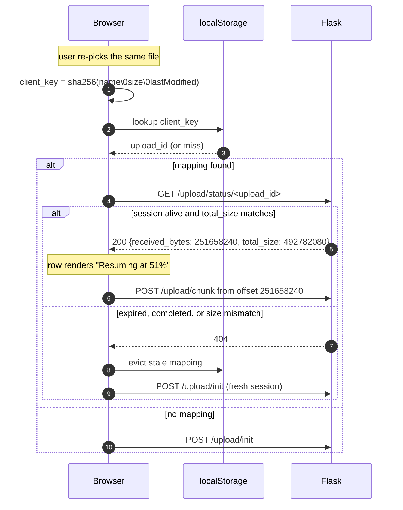
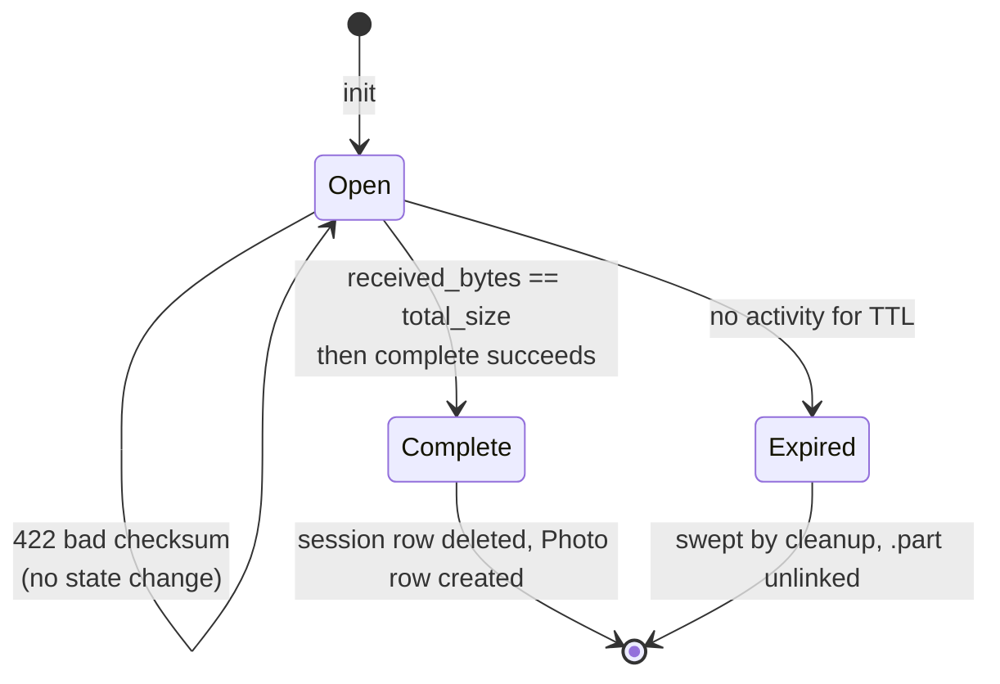
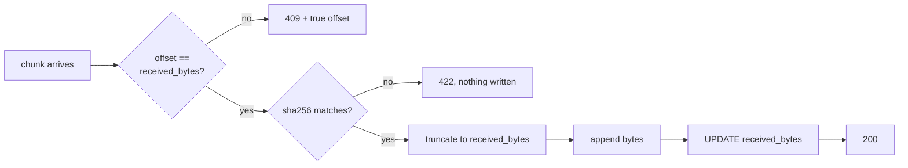

# Chunked Resumable Upload Protocol

Reference for the wire contract between `static/js/uploader.js` and the upload endpoints in
`src/pixelvault/routes/share.py`. Implements [#29](https://github.com/gfvandehei/PixelVault/issues/29).

**This document is the contract.** Client and server are built in parallel against it; neither side
may change a shape here without updating this file first.

---

## 1. Why chunking exists

`photos.gvandehei.com` is proxied through Cloudflare, whose free plan rejects any request body over
**100 MB** at the edge. The origin never sees the request, so nothing appears in the app logs and
the browser observes bytes silently ceasing to move.

Uploads are therefore sliced into **8 MiB** chunks, each a separate HTTP request, well under any
edge limit. A secondary benefit is that the transfer becomes resumable: a dropped connection costs
one chunk, not the whole file.

| Constant | Value | Rationale |
|---|---|---|
| `UPLOAD_CHUNK_SIZE` | 8 MiB (8388608) | ~13 s per chunk on a 5 Mbit uplink — inside Gunicorn's worker timeout |
| `CHUNK_THRESHOLD` | 8 MiB | Files at or below this use the legacy single-request path unchanged |
| `UPLOAD_SESSION_TTL_HOURS` | 24 | How long a partial upload remains resumable |

A 470 MB file becomes ~59 chunks.

---

## 2. Endpoint overview

All endpoints are `@login_required` and scoped to an album share token.

| Method | Path | Purpose |
|---|---|---|
| `POST` | `/share/<token>/upload/init` | Open or recover an upload session |
| `GET` | `/share/<token>/upload/status/<upload_id>` | Probe resume offset |
| `POST` | `/share/<token>/upload/chunk/<upload_id>` | Append one chunk |
| `POST` | `/share/<token>/upload/complete/<upload_id>` | Assemble, validate, commit |

The legacy `POST /share/<token>/upload` remains for files under the threshold and is **not
modified**.

---

## 3. Happy path

```mermaid
sequenceDiagram
    autonumber
    participant C as Browser
    participant S as Flask
    participant D as Disk
    participant DB as SQLite

    C->>S: POST /upload/init {client_key, filename, total_size}
    S->>DB: INSERT upload_session (received_bytes=0)
    S->>D: create partials/<upload_id>.part
    S-->>C: 201 {upload_id, chunk_size, received_bytes: 0}

    loop each 8 MiB chunk
        C->>C: sha256(chunk) via crypto.subtle
        C->>S: POST /upload/chunk/<id><br/>X-Upload-Offset, X-Chunk-SHA256
        S->>S: verify offset == received_bytes
        S->>S: verify sha256 matches body
        S->>D: truncate(received_bytes) then append
        S->>DB: UPDATE received_bytes
        S-->>C: 200 {received_bytes}
    end

    C->>S: POST /upload/complete/<id>
    S->>S: validate_file() on assembled file
    S->>D: save_file() — HEIC convert, thumbnail, EXIF
    S->>DB: INSERT photo; DELETE upload_session
    S-->>C: 200 {results: [{filename, success: true}]}
```

---

## 4. Resume path

The client persists `client_key -> upload_id` in `localStorage`, namespaced by album token. On
re-selecting a file it probes before transferring anything.



**Browsers cannot re-read a `File` handle across a reload**, so the user must re-select the file.
The *upload* then resumes; the *selection* does not persist. This is a platform constraint, not a
design choice.

---

## 5. Session lifecycle



There is no explicit "assembling" state. Because chunks append in place, the `.part` file *is* the
final artefact — `complete` renames/processes it rather than concatenating anything.

---

## 6. Request and response shapes

### 6.1 `POST /share/<token>/upload/init`

```jsonc
// request
{
  "client_key":    "a3f1…",           // 64 lowercase hex chars, see §7
  "filename":      "IMG_1234.MOV",
  "total_size":    492782080,          // bytes, integer
  "content_type":  "video/quicktime"   // advisory only; never trusted
}
```

```jsonc
// 201 Created — new session
// 200 OK      — existing session recovered (idempotent on client_key)
{
  "upload_id":      "9f2c…",
  "chunk_size":     8388608,
  "received_bytes": 0,
  "total_size":     492782080,
  "resumed":        false
}
```

Idempotent on `(user_id, album_id, client_key)`. Re-initialising an in-flight upload returns the
existing session with `resumed: true` and its true `received_bytes` — it never restarts the
transfer or orphans the `.part` file.

### 6.2 `GET /share/<token>/upload/status/<upload_id>`

```jsonc
// 200 OK
{
  "upload_id":         "9f2c…",
  "received_bytes":    251658240,
  "total_size":        492782080,
  "original_filename": "IMG_1234.MOV",
  "expires_at":        "2026-08-19T13:04:00Z"
}
```

`404` if the session is unknown, expired, or already completed. The client treats all three
identically: evict the `localStorage` mapping and start fresh.

### 6.3 `POST /share/<token>/upload/chunk/<upload_id>`

Body is **raw bytes**, not multipart — multipart parsing per chunk is pure overhead when the
payload is a single anonymous blob.

```
Content-Type:    application/octet-stream
Content-Length:  8388608
X-Upload-Offset: 251658240      // byte offset this chunk begins at
X-Chunk-SHA256:  b7e2…          // 64 lowercase hex chars, digest of THIS chunk only
```

```jsonc
// 200 OK
{ "received_bytes": 260046848 }
```

### 6.4 `POST /share/<token>/upload/complete/<upload_id>`

Empty body. Returns the **same envelope as the legacy endpoint**, so
`uploader.js` response handling is shared by both paths:

```jsonc
// 200 OK
{ "results": [ { "filename": "IMG_1234.MOV", "success": true } ] }

// 200 OK — per-file validation failure (NOT a transport error)
{ "results": [ { "filename": "evil.mov", "error": "File type 'application/x-dosexec' is not allowed" } ] }
```

Per-file problems ride inside `results` with HTTP 200, matching `do_upload`. Reserve 4xx for
transport- and session-level faults.

---

## 7. `client_key` derivation

```js
client_key = sha256_hex(`${file.name}\0${file.size}\0${file.lastModified}`)
```

**The server treats this as an opaque token** and never recomputes it. It is validated only as
`^[0-9a-f]{64}$` and used as an idempotency key. This means the two sides cannot drift out of sync
over the hashing details.

Including `lastModified` and `size` means an edited or replaced file yields a different key and
correctly starts a new session rather than resuming into a mismatched prefix.

---

## 8. Status codes

| Code | Meaning | Client action | Rate-charged? |
|---|---|---|---|
| `200` | Chunk accepted / status / complete | Continue | No |
| `201` | New session created | Continue | No |
| `400` | Malformed headers or JSON | Fail permanently | Yes |
| `403` | Uploads disabled, or session not owned by caller | Fail permanently | Yes |
| `404` | Album or session unknown/expired | Evict mapping, re-init | No |
| `409` | **Offset mismatch** — body carries true `received_bytes` | Re-seek, continue | **No** |
| `413` | `total_size` exceeds `MAX_CONTENT_LENGTH`, or chunk overruns `total_size` | Fail permanently | Yes |
| `422` | **Checksum mismatch** — chunk corrupt in transit | Retry the same chunk | **Yes** |
| `429` | Quota or rate limit hit | Back off, surface to user | — |

The `409` / `422` distinction is load-bearing. A `409` is *normal control flow* — it is how a
resuming client discovers where to seek, and two tabs racing will produce them legitimately. A
`422` means bytes arrived corrupted or forged. Only the latter is charged against the rate limit:

```python
@limiter.limit("60 per hour", deduct_when=lambda r: r.status_code == 422)
```

A plain count limit cannot work here: one 500 MB file is 63 requests, so request count no longer
correlates with cost. See #29 for the full reasoning, including the bad-checksum replay attack that
rules out simply exempting the endpoint.

---

## 9. Integrity and crash safety

**Every append is idempotent.** Before writing, the server executes
`os.truncate(path, session.received_bytes)`. A chunk that half-landed before the socket died is
discarded rather than duplicated. This makes the on-disk length and the DB counter converge without
a repair pass.



Order matters: truncate-then-append must precede the DB update, so a crash between the two leaves
`received_bytes` *behind* the file length. The next chunk truncates the excess away. The reverse
order would leave the counter ahead of the data and corrupt the file irrecoverably.

---

## 10. Limits

Chunking removes protections the app currently relies on. All four are mandatory.

| Control | Where | Why |
|---|---|---|
| `total_size <= MAX_CONTENT_LENGTH` | `init` | `MAX_CONTENT_LENGTH` is per-request and each request is now 8 MiB — it no longer bounds an upload |
| `received_bytes + len(chunk) <= total_size` | every chunk | Without it a client can stream unbounded bytes to disk by lying at init |
| Open sessions per user (10), in-flight bytes per user | `init` | Bounds abandoned partials |
| Per-route `request.max_content_length` | `chunk` | The chunk endpoint has no business accepting 500 MB |

The DB-backed quotas are the **load-bearing** defence. The rate limiter is secondary damping:
`storage_uri="memory://"` with 2 workers means limits are per-process and reset on every deploy.

Per-user quotas depend on the limiter having a per-user key, which it does not currently have —
see [#30](https://github.com/gfvandehei/PixelVault/issues/30).

---

## 11. Validation

| Stage | Check | Purpose |
|---|---|---|
| First chunk | `magic.from_buffer` on the leading bytes | Reject a disallowed type after 8 MiB rather than 470 MB |
| `complete` | Full `validate_file()` on the assembled file | **The security boundary** |

The first-chunk check is an optimisation only. A client controlling the first 8 MiB could pass it
and fail the authoritative check — which is exactly what should happen.

---

## 12. Storage layout

```
UPLOAD_FOLDER/
├── <uuid>.jpg                 # committed originals
├── thumb_<uuid>.jpg           # 400x400 thumbnails
└── partials/
    └── <upload_id>.part       # in-flight uploads only
```

`serve_media` (`media.py:28`) already rejects any filename containing `/` or `..`, so `partials/`
is unreachable through the media endpoint. Re-verify this after touching the storage layout.

---

## 13. Cleanup

Abandoned sessions leak `.part` files. With no task queue in the stack, cleanup is opportunistic:
a sweep runs inside `init`, throttled to at most once every few minutes, deleting sessions older
than `UPLOAD_SESSION_TTL_HOURS` along with their partials. `flask cleanup-uploads` triggers the same
sweep manually.
